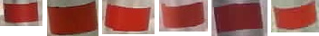
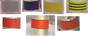

Algorithm 1: MatchTemplate with Histograms
============================================
Insert text here

Main Function
---------------
The workflow of the main function is as follows:

* Use the `matchTemplate <https://docs.opencv.org/master/d4/dc6/tutorial_py_template_matching.html>`_ function.
* Remove duplicated matches
* Finding collinear matches
* Calculating displacements in pixel with the help of histograms
* Calculating a conversion factor from px to metric units with the help of histograms

.. automodule:: matchtemplate
    :members: matchTemplate_hist

Important instructions for the template image
~~~~~~~~~~~~~~~~~~~~~~~~~~~~~~~~~~~~~~~~~~~~~~~~~~

The template is an image of one tape. This template is then used to detect and track all tapes in the whole time series. Therefore, the chosen template can have a considerable impact on the results.
Generally, the following criteria should be met to generate good results:

* The represented tape should have a high contrast to the background (no white, grey, yellow)
* The represented tape should have a high saturation (no white, black, grey, dark blue)
* The represented tape should be located in the middle of the pole, so the distortion differences are minimized.
* The template should contain a small margin on all edges.
* The size of the represented tape must be the same as in the original image. It is recommended to create the template by cropping a full image, so there is no resizing.

Simply put, the template should be as representative as possible compared to all tapes, all images, all exposures. If the pole is always inclined for the whole time series, the tape on the template should be inclined as well.
Ideally, the color of the tape in the template is red, because the contrast as well as the saturation is high.

Some examples for good templates:

    Examples for good templates. There is enough margin around the tapes, there is good saturation and contrast present.

The following images show some bad examples for templates:

    Top row (left to right): low saturation/contrast, too dark and no saturation, good saturation but no contrast, texture filling.
    Bottom row (left to right): not enough margin, too much margin, distorted tape (too low on the pole)

Important instructions for the image series
~~~~~~~~~~~~~~~~~~~~~~~~~~~~~~~~~~~~~~~~~~~~~~
The whole time series is a set of images in a folder. This folder is given the function as an input. The following criteria should be met:

* The import order is alphabetical.
* The filenames must be timestamps in the following format: yyyy-mm-dd_hh-mm (e.g. 2019-06-27_11-59.jpg) other image file types are also allowed
* The algorithm is tested and optimized for time intervals of 20 minutes between images. Different intervals are generally possible (yet untested), but the displacements between two images must not exceed 4 cm.
* Footage from installation work at the beginning of the time series must be removed. The first image should only contain the installed pole.
* The initial position of the pole should preferably cover already the whole image height and not only the very bottom.
* Dark/blurry images do not have to be removed if the period of bad image quality is not too long ( > 2 days )
* Displacements during data gaps longer than 1 day will not be calculated correctly and have to be added manually.

Important instructions for the chosen threshold
~~~~~~~~~~~~~~~~~~~~~~~~~~~~~~~~~~~~~~~~~~~~~~~~
The threshold filters results from the matchTemplate function comparing target image and template. Sub-areas of the target image with a correlation value higher than the threshold are considered a match and are used for further calculations.
Some remarks:

* The algorithm has proven to work best for thresholds between 0.7 - 0.75
* It is recommended to run the program several times with different thresholds. This makes it very easy to detect outliers and calculation errors.
* Higher thresholds may lead to a loss of correlation and termination of the program if there is a longer period of bad quality images (e.g. snowfall)
* Lower thresholds may lead to higher instability of the algorithm (wrong displacement calculations)

Subfunctions
---------------------------------------
The following functions are called by the main function. Those functions are not intended to use individually. The documentation is therefore purely for a better understanding of the main function.

Removing Duplicates
~~~~~~~~~~~~~~~~~~~~
.. automodule:: matchtemplate
    :members: remove_duplicates

Finding Collinear Matches
~~~~~~~~~~~~~~~~~~~~~~~~~~
.. automodule:: matchtemplate
    :members: find_collinear

Calculating Displacements
~~~~~~~~~~~~~~~~~~~~~~~~~~
.. automodule:: matchtemplate
    :members: get_distance, compare_matches

Calculating Conversion Factor
~~~~~~~~~~~~~~~~~~~~~~~~~~~~~~
.. automodule:: matchtemplate
    :members: get_scale, clean_scales, px_to_cm

Other functions
~~~~~~~~~~~~~~~~
.. automodule:: matchtemplate
    :members: load_images_from_folder, draw_rectangle